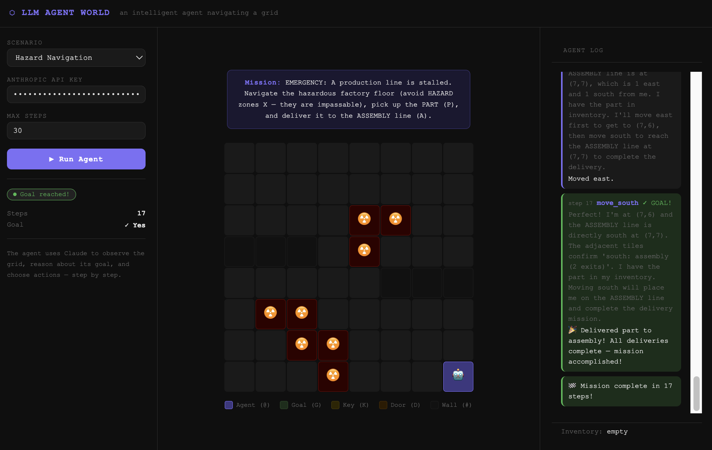

# LLM Agent World

An LLM agent placed into a 2D grid world — it perceives its environment through a limited sensor range, reasons about what to do next, and acts to accomplish goals.

## Quick Start

```bash
# 1. Install dependencies
pip install fastapi uvicorn httpx

# 2a. Web UI
uvicorn server:app --reload
# Open http://localhost:8000 — enter your Anthropic API key and pick a scenario

# 2b. Terminal
python run_cli.py --scenario key_door --api-key sk-ant-...
# (or export ANTHROPIC_API_KEY=sk-ant-... first)
```

---

## Scenarios

| Scenario | Description | Vision | Key mechanic |
|---|---|---|---|
| `reach_goal` | Navigate a walled maze to reach the goal tile | radius 2 | Pathfinding |
| `key_door` | Pick up a key, unlock a door, reach the goal | radius 3 | Sequencing |
| `exploration` | Explore a grid with multiple objects to collect | radius 2 | Exploration |
| `factory_delivery` | Carry a part through a locked gate to the assembly line | radius 3 | Delivery + gate |
| `warehouse_sort` | Sort two boxes to their respective depots | radius 3 | Multi-delivery |
| `hazard_navigate` | Deliver a part while avoiding impassable hazard zones | radius 2 | Obstacle avoidance |
| `collab_delivery` | Two robots cooperate — Robot A unlocks a gate, Robot B delivers a part through it | radius 3 | Multi-agent cooperation |

The **robotics scenarios** (`factory_delivery`, `warehouse_sort`, `hazard_navigate`) are inspired by real industrial robot tasks — navigating factory floors, handling parts, and responding to hazards. **`collab_delivery`** extends this with two cooperative agents that must coordinate to complete a shared mission.

---

## Architecture

```
llm-agent-world/
├── world/
│   ├── grid.py         # GridWorld engine — tiles, objects, fog of war, observations
│   └── multi_agent.py  # Multi-agent world — two cooperative robots, shared sensor data
├── agent/
│   └── harness.py      # Agent harness — prompt builder, LLM caller, action parser
├── static/
│   ├── index.html      # Web UI — live grid visualiser (SSE consumer)
│   └── styles.css
├── logs/               # One .jsonl file per run (auto-created)
├── server.py           # FastAPI server — /run endpoint with SSE streaming
├── run_cli.py          # Terminal runner — coloured ASCII output + JSONL log
└── requirements.txt
```

### Data flow

```
GridWorld                  Harness                     Claude
    │                         │                           │
    │── get_observation() ───▶│                           │
    │   · position            │── build_prompt() ────────▶│
    │   · fog-of-war map      │   · mission               │
    │   · visible neighbors   │   · observation           │
    │   · inventory           │   · history (last 10)     │
    │   · goal hint           │                           │
    │   · explore hint        │◀── { reasoning, action,  ─│
    │   · facing direction    │      stuck, stuck_reason } │
    │   · recent messages     │                           │
    │                         │                           │
    │◀── step(action) ────────│                           │
    │   · move / pick_up      │                           │
    │   · update visited/seen │                           │
    │   · return result       │                           │
    │                         │                           │
    └──────── repeat until done or max_steps ─────────────┘
```

### The agent loop (per step)

1. **Observe** — `GridWorld.get_observation()` serialises position, fog-of-war ASCII map, visible neighbours with exit counts, inventory, goal hint, explore hint, and facing direction into a structured dict.
2. **Decide** — `Agent.decide()` formats the observation into a prompt, calls Claude, and parses the JSON response. The agent self-assesses whether it is stuck on every step.
3. **Act** — `GridWorld.step(action)` executes the action and returns a result message, which is fed back into the next prompt as recent history.

---

## Design choices

### Fog of war (limited sensor range)

Each agent has a `vision_radius` — a Chebyshev-distance sensor cone. Tiles outside this range render as `?` until the agent physically moves close enough to reveal them. Once seen, tiles remain revealed (persistent memory), matching how a real robot would build a local map incrementally.

```
# Step 1 — agent at top-left, vision_radius=2
@..????
...????
...????
???????

# Step 5 — after exploring south-east
·····??
·····??
·@···??
·····??
```

This makes the challenge meaningful: the agent cannot simply read the goal position off the initial map — it has to plan under uncertainty and update as it explores.

### Observation design

The agent receives seven fields per step, each chosen to answer a specific question the agent needs to reason well:

- **Position** `(x, y)` — where am I?
- **Fog-of-war ASCII map** — visited cells `·`, unvisited seen cells `.`, unseen cells `?`. Encodes full spatial memory in a single visual token the LLM can parse at a glance, without requiring a separate coordinate list.
- **Neighbours with exit counts** — what is adjacent, and how open is it? e.g. `"west: empty (1 exit ⚠ DEAD-END)"` warns the agent before it enters a trap tile.
- **Goal hint** — context-aware next-target hint. Respects fog: only reveals coordinates of objects the agent has already seen; otherwise says "explore to find it". Priority chain: key/gate → delivery item → delivery target → goal.
- **Explore hint** — BFS-computed frontier target, scored by how many unseen tiles lie in that direction. Points the agent toward the largest unexplored region rather than the nearest tile, preventing the agent from hugging walls or revisiting explored areas.
- **Facing direction** — last successful move direction, used with the left-hand wall-following rule when the agent is stuck.
- **Recent messages** — last 3 action results (short-term memory without growing context unboundedly).

### Explore hint: unseen-count scoring

A naive frontier algorithm picks the nearest unseen tile, which causes the agent to hug walls and explore trivial border tiles rather than heading into large unknown regions. The explore hint scores each frontier candidate with:

```
score = open_direction_bonus - sqrt(distance) - boundary_penalty
```

`open_direction_bonus` counts passable unseen tiles in the frontier's direction, normalised across all four quadrants:

```python
# More unknown territory in that direction → higher bonus
bonus = unseen_count[direction] / total_unseen * 3.0
```

`boundary_penalty` discourages map-edge tiles (nothing beyond them) and tiles with few exits (likely dead ends). The result is an agent that naturally steers toward the interior of unexplored space rather than methodically sweeping the perimeter.

A sticky `explore_target` holds the chosen frontier across steps to avoid jitter, but switches automatically if a significantly better candidate emerges (score gap > 1.5).

### Action space

```
move_north / move_south / move_east / move_west
pick_up   — pick up item at current tile
wait      — do nothing
```

Minimal and unambiguous. The LLM names one action per turn; no argument parsing needed. `look` was considered but removed — since neighbour information is already included in every observation, a dedicated look action would only waste a step without adding information.

### Structured output

The agent responds in JSON on every step:

```json
{
  "reasoning": "Key is one tile east — pick it up before approaching the door.",
  "action": "move_east",
  "stuck": false,
  "stuck_reason": ""
}
```

The `reasoning` field makes the agent's intent observable and debuggable. The `stuck` field is the first layer of the reflection loop — the agent self-reports when it believes it is looping or blocked.

### Two-layer reflection loop

When the agent gets stuck, a separate LLM call diagnoses the failure and injects a corrective strategy into conversation history:

```
Layer 1 — LLM self-assessment:
  Agent sets stuck=true in its response → reflection triggers immediately.
  The agent noticed the problem before any rule caught it.

Layer 2 — Rule-based fallback (StuckDetector):
  Fires when the LLM fails to self-report. Detects:
    · Position loop  — same tile visited ≥ 3 times in last 8 steps
    · Action loop    — same action repeated ≥ 4 times without positional progress
    · Wall bumping   — "Blocked" result ≥ 3 times in last 8 steps
```

Either layer triggers the same reflection flow: a dedicated `REFLECTION_SYSTEM_PROMPT` call produces a `{ diagnosis, strategy }` pair that is injected into conversation history. The action LLM then reasons with that context on the very next step. Maximum 3 reflections per run to prevent infinite loops. JSONL logs record which layer triggered each reflection (`llm_stuck` vs `[fallback]`).

### Conversation history

A rolling window of the last 10 turns (observation + response pairs) gives the LLM short-term memory of what it has tried — preventing it from repeating the same failed action in a loop.

### Multi-delivery sequencing

Factory scenarios use a `deliveries` queue: a list of `(item, target)` pairs processed in order. The hint system always points at the current priority target. On delivery, the queue advances and the agent is told what comes next.

### Multi-agent cooperation

`collab_delivery` places two robots in the same world with complementary roles:
Robot A (OPENER) must find a key and unlock a gate; Robot B (DELIVERER) must
collect a part and deliver it through that gate to an assembly line on the other side.
Neither can complete the mission alone.

Key design decisions:
- **Shared sensor data** — both robots merge their `seen` sets after every move,
  so discoveries by one are immediately visible to the other. This mirrors real
  multi-robot systems where agents broadcast sensor readings over a shared network.
- **Role-aware goal hint** — each robot receives a hint tailored to its role,
  preventing them from interfering with each other's tasks.
- **Independent LLM instances** — each robot has its own conversation history and
  StuckDetector, so one robot's stuck state doesn't pollute the other's reasoning.
- **Turn-based execution** — robots alternate turns (A → B → A → …), giving each
  full visibility of the other's last action before deciding.
  
---

## Example run

### Web UI



The web UI provides:
- **Live grid visualization** — watch the agent explore in real time
- **Mission display** — current goal and progress
- **Agent log** — reasoning, actions, and results for each step
- **Inventory tracking** — what the agent is carrying
- **Status indicator** — running, success, or failure

### Terminal Output

```
=== LLM Agent World ===
Scenario : hazard_navigate
Mission  : Navigate the hazardous factory floor, pick up the PART, deliver to ASSEMBLY.

@ ? ? ? ? ? ? ?
? ? ? ? ? ? ? ?
? ? ? ? X X ? ?
# # # ? X ? ? ?
? ? ? ? ? # # #
? X X ? ? ? ? ?
? ? X X ? ? ? ?
? ? ? X ? ? ? A

[step 01] move_south    Following explore hint toward open southern area
          → Moved south.

[step 05] pick_up       Standing on the PART at (3,1)
          → Picked up part.

[step 09] move_south    Explore hint points south — large unknown region
          → Moved south. (3,3) — passing through narrow corridor

[step 15] move_east     ASSEMBLY now visible at (7,7)
          → Moved east.

[step 17] move_south    Delivering to ASSEMBLY
          → 🎉 Delivered part to assembly! Mission accomplished!

🎉 Mission complete in 17 steps!
Log saved → logs/run_20260524_141400_hazard_navigate.jsonl
```

Full run logs are saved as JSONL (one line per step) in `logs/`. Each step records action, reasoning, result, position, inventory, and reflection status. See `logs/example_key_door.jsonl` for a complete example.

---

## What worked

- **Unseen-count frontier scoring** — steering the agent toward large unexplored regions rather than the nearest tile was the single biggest improvement. Without it, the agent hugged walls and missed the only south-facing corridor in `hazard_navigate`.
- **Dead-end warning in neighbours** — `"west: empty (1 exit ⚠ DEAD-END)"` prevents the agent from entering trap tiles it can already see are dead ends before stepping in.
- **Two-layer reflection loop** — LLM self-assessment catches most stuck cases immediately; the rule-based fallback catches the cases the LLM misses. Separating diagnosis (reflection LLM) from action (main LLM) keeps each call focused.
- **Fog of war** makes exploration meaningful — the agent has to navigate under uncertainty rather than reading the answer off the initial map.
- **Context-aware goal hint** with fog-awareness — only reveals target coordinates after the agent has actually seen them, so hints are always actionable.
- **JSON output with `reasoning`** makes every decision transparent and debuggable.

## What could be improved

- **No explicit path planning** — the agent reasons step-by-step rather than computing a full route; a planning step before acting would reduce backtracking in complex mazes.
- **No long-term spatial map** — the `seen` set persists per run but the LLM receives only the current ASCII snapshot; an explicit graph structure passed in context could support more deliberate route planning on larger grids.